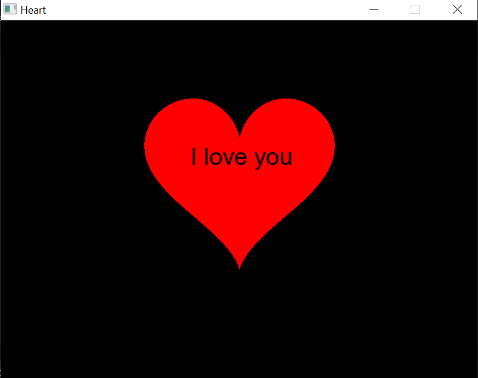

# Heart
Heart C++ SFML

---

 

 

English : 
This project was created with the aim of declaring your love to someone you love. 

French : Ce projet à été crée dans le but de déclarer son amour à une personnes que l'on aime 